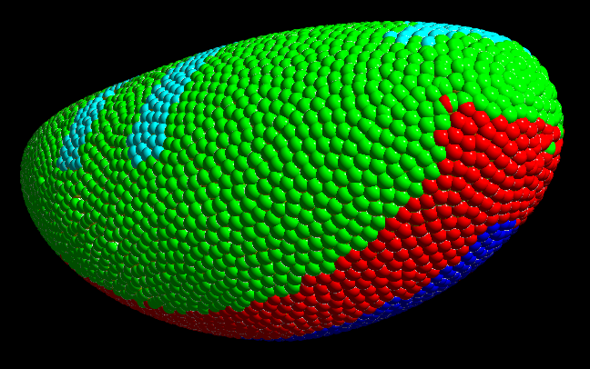

# Small outline of what is variable in the model as of right now

Mainly, the initial conditions, ie. the shape of the egg, how many cells per cm^2 and where the different cell types start, are varied.

For refence, this is the 'current best' egg:

### For all cell types
lambda_1 is changed in between (0.2-0.5)
Lowering it makes it more 'flowy', but having it too low makes the sheets fall apart.

### For 'red' and 'dark blue' cells:
lambda_1 and lambda_3 between (0.0-0.2)
lambda_3 controls the convergent extension. Raising it makes the germ band extension happen, but having it too high look unphysical with

### For 'light blue' and 'dark blue' cells:
The apical constriction parameter alpha is changed. (0.1-0.5)
This controls the internal diameter of potentially generated tubes.

### Also:
- First or second nearest neighbors, or a mix, or cutoff-distance.
- Preferential Adheation between different cell types.
- Timing! (Both getting the timing right and trying to avoid doing it 'manually')
- Trying alpha inversely proportional to distance when looking at more than nearest neighbors. 

# Latest best version:
In general the lamdas are:

"lambda1": 0.22,
"lambda2": 0.5,
"lambda3": 0.08,

### 'green cells'
No lambda_3. Differential adheation wrt. 'red cells' with a factor of 0.8.

### 'red cells'
Differential adheation wrt. 'red cells' with a factor of 0.8 on the S.

### 'light blue cells'
No lambda_3. Isotropic wedging with alpha = 0.5

### 'dark blue cells'
Anisotropic wedging with alpha = 0.5. Also has lambda_3 the same as 'red cells'.

### Also
No timing.

The interaction matrix is symmetric, meaning, that 'red cells' interact with 'green cells' as if they where 'green' themselves etc. 